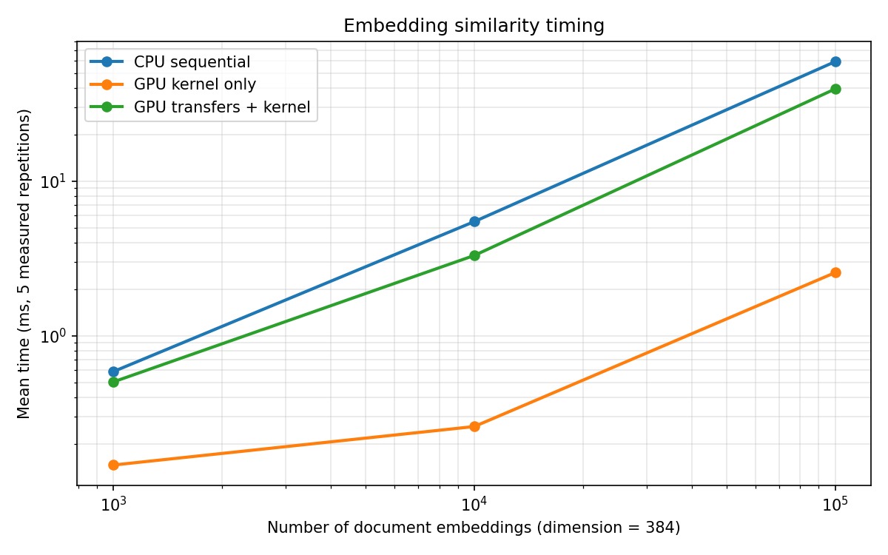

# CUDA Embedding Similarity Search

A C++/CUDA implementation of cosine-similarity search over dense float32
embeddings. The program normalizes deterministic synthetic inputs on the CPU,
computes document scores on the GPU, validates every result against sequential
CPU references, selects the five highest-scoring documents, and records
reproducible benchmark data.

The CUDA kernel uses a direct data-parallel mapping: one thread processes one
document and accumulates its complete dot product. Because all vectors are
normalized first, the dot product is cosine similarity.

## Project files

- `similarity_search.cu` contains deterministic data generation, safe CPU
  normalization, sequential float and double CPU references, the CUDA kernel,
  validation, CPU top-k, and CSV benchmark output.
- `colab_demo.ipynb` checks the Colab GPU toolchain, lets you upload the CUDA
  source, compiles and runs it, then plots the measured CSV.
- `benchmark_results.csv` contains five measured repetitions for each input
  size.
- `timing_chart.png` visualizes the mean CPU, kernel-only, and
  transfer-plus-kernel timings.

The program intentionally has no CPU-only fallback. If CUDA is unavailable, it
prints a clear error so a missing GPU is not mistaken for a successful GPU run.

## Run in Google Colab

1. Open `colab_demo.ipynb` in Google Colab.
2. Choose **Runtime > Change runtime type**, select a **GPU** hardware
   accelerator, and save.
3. Run the cells in order.
4. When prompted, upload `similarity_search.cu` from this folder. If it is
   already present in the Colab working directory, the upload cell keeps it.

The notebook checks both `nvidia-smi` and `nvcc`. It then compiles with:

```bash
nvcc -O2 -std=c++17 similarity_search.cu -o similarity_search
```

The executable first runs a tiny hand-checkable example. For query `[1, 0]`,
the normalized documents and expected scores are:

| Document | Meaning | Expected score |
|---|---|---:|
| `[1, 0]` | same direction | `1` |
| `[0, 1]` | perpendicular | `0` |
| `[1, 1]` | 45 degrees | `1/sqrt(2)` |
| `[-1, 0]` | opposite direction | `-1` |
| `[0, 0]` | zero vector | `0` |

It also checks 1,003 documents, deliberately not divisible by the 256-thread
block size, to exercise the kernel bounds check. The benchmark sizes 1,000,
10,000, and 100,000 are also not divisible by 256.

## Correctness policy

Normalization accumulates squared norms in double precision on the CPU, then
stores normalized values as float32. A zero-norm document is left as zeros, so
there is no division by zero and its score is zero. The fixed random seed makes
the generated inputs repeatable for each document count.

The GPU result for every document is compared with the sequential float32 CPU
reference. The allowed absolute difference is `1e-5`. This small tolerance
accounts for ordinary rounding differences such as GPU fused multiply-add in a
384-term dot product. A second CPU reference accumulates the same float32 inputs
in double precision. The CSV reports these maximum absolute errors:

- GPU float versus CPU float (the pass/fail comparison)
- GPU float versus CPU double
- CPU float versus CPU double

## Benchmark meaning

Each size gets one unmeasured CPU warm-up and one unmeasured GPU warm-up,
followed by five measured repetitions. `benchmark_results.csv` stores every
measured repetition.

- `cpu_ms`: sequential float32 CPU dot products, measured with a steady
  wall-clock timer.
- `gpu_kernel_ms`: only the CUDA kernel with inputs already on the GPU,
  measured using CUDA events.
- `transfer_plus_kernel_ms`: host-to-device document and query copies, kernel,
  and device-to-host score copy, measured with a steady wall-clock timer.

Data generation, normalization, device allocation, correctness validation,
double-precision reference calculation, top-k selection, console output, and
CSV writing are excluded from all three timings. The kernel-only and
transfer-plus-kernel values come from separate launches in each repetition.

The notebook groups the measured rows by document count, plots the mean of the
three timings, and saves `timing_chart.png`.

## Measured results

These measurements were collected in Google Colab using an NVIDIA Tesla T4,
NVIDIA driver 580.82.07, and CUDA compiler 12.8. Values are the mean of five
repetitions, shown as mean +/- sample standard deviation.

| Documents | CPU sequential (ms) | GPU kernel only (ms) | Transfers + kernel (ms) |
|---:|---:|---:|---:|
| 1,000 | 0.587 +/- 0.169 | 0.146 +/- 0.001 | 0.503 +/- 0.017 |
| 10,000 | 5.475 +/- 0.200 | 0.259 +/- 0.001 | 3.307 +/- 0.045 |
| 100,000 | 59.263 +/- 6.281 | 2.563 +/- 0.015 | 39.484 +/- 3.190 |



The kernel-only measurement isolates device computation, while the complete
GPU path includes the cost of moving a new document matrix to the GPU. At
100,000 documents, kernel execution averaged 2.563 ms and the complete path
averaged 39.484 ms, showing that data movement accounts for most of the
end-to-end GPU cost in this setup.

The largest numerical errors recorded across all benchmark sizes were:

| Comparison | Maximum absolute error |
|---|---:|
| GPU float vs. CPU float | `5.96046448e-08` |
| GPU float vs. CPU double | `2.10856548e-07` |
| CPU float vs. CPU double | `2.10856548e-07` |

All GPU results remained well within the configured absolute tolerance of
`1e-5`. The timings describe this specific Colab session; shared-runtime load
and assigned hardware can affect absolute measurements.

## Command-line usage

On any Linux system with the CUDA toolkit and an NVIDIA GPU:

```bash
nvcc -O2 -std=c++17 similarity_search.cu -o similarity_search
./similarity_search
```

Run only validation or choose a different CSV path with:

```bash
./similarity_search --correctness-only
./similarity_search --output my_results.csv
```

The largest input contains 38.4 million float32 values, about 154 MB for the
document matrix, plus smaller host and device buffers.

## Design boundaries

The kernel assigns an entire dot product to one thread. It does not parallelize
dimensions within a document, overlap transfers with execution, or perform
top-k selection on the GPU. This implementation focuses on thread indexing,
device memory management, kernel execution, correctness validation, and timing.
Parallel reduction, asynchronous transfers, and GPU top-k are possible topics
for a separate optimization study.
